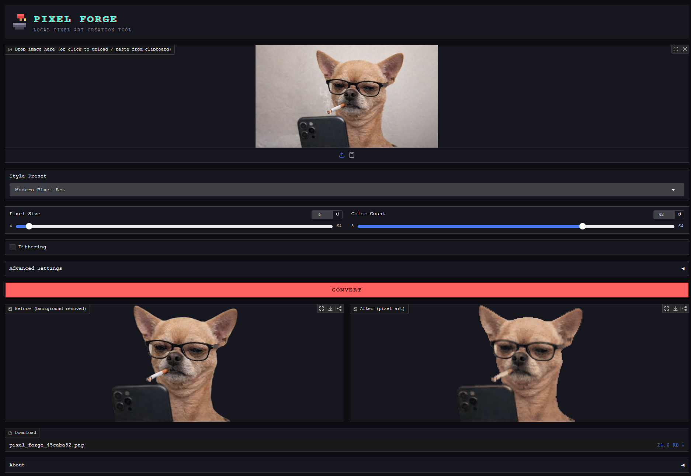

<p align="center">
  
</p>

<h1 align="center">PIXEL FORGE</h1>

<p align="center">
  A retro-inspired, fully offline pixel-art creation tool.
</p>

<p align="center">
  Transform images into crisp pixel art and game-ready sprites using local AI processing.
  <br>
  No cloud services. No APIs. No subscriptions.
</p>

---

# PIXEL FORGE

A minimalist offline pixel-art studio.

Upload an image, remove the background locally, and forge it into clean, crisp pixel art or a ready-to-use game sprite.

Everything runs on your machine using local processing.

## Features

- Drag-and-drop image upload
- Paste images directly from clipboard
- Local AI background removal using `rembg` + `onnxruntime`
- No external APIs or cloud services
- Pixel-art conversion pipeline optimized for crisp results
- Transparent PNG output
- Game sprite creation mode
- Retro pixel-art style presets

### Pixel Art Controls

- Pixel Size: 4–64
- Color Count: 8–64
- Optional Floyd–Steinberg dithering
- Nearest Neighbor scaling for sharp pixel edges

### Style Presets

Included presets:

- Classic Gameboy
- NES Retro
- SNES 16-bit
- Modern Pixel Art
- Minimal 8-color
- Arcade Style

Presets automatically adjust:

- Pixel size
- Color palette
- Dithering
- Contrast
- Saturation
- Overall visual style

---

# Advanced Settings

Advanced controls are hidden by default to keep the interface simple.

Available options:

## Export

Formats:

- PNG
- JPG
- WEBP

Output scale:

- 1x
- 2x
- 4x
- 8x

## Background

Options:

- Transparent
- Original background
- White
- Black
- Custom color

## Image Adjustments

Optional controls:

- Brightness
- Contrast
- Saturation
- Sharpness

Applied before pixel conversion.

## Edge Refinement

Improves background removal quality around:

- Hair
- Small details
- Complex outlines

Powered by local alpha matting.

## Canvas Modes

Supported canvas sizes:

- Auto
- 32x32
- 64x64
- 128x128
- 256x256

Placement:

- Fit
- Fill
- Center

---

# Sprite Mode

Enable:


Create Game Sprite


Automatically:

- Removes background
- Keeps transparency
- Centers the subject
- Uses a fixed canvas
- Creates game-ready assets

Perfect for:

- Indie games
- Character sprites
- Item icons
- Pixel illustrations

---

# Project Structure


pixel-forge/

├── app.py # Gradio interface and application logic
├── background.py # Local AI background removal
├── pixelizer.py # Pixel-art conversion pipeline
├── presets.py # Retro style presets
├── assets.py # Logo, CSS theme, branding assets
├── utils.py # Image utilities and export helpers
├── requirements.txt
└── README.md


---

# Installation

## 1. Create a virtual environment

```bash
python -m venv venv

Activate it:

Windows
venv\Scripts\activate
macOS / Linux
source venv/bin/activate
2. Install dependencies
pip install -r requirements.txt
First Run

The first time the application runs, rembg downloads the local background-removal model (u2net).

Size:

~170 MB

This happens only once.

After that:

No internet connection required
No API keys
Fully offline processing
Running PIXEL FORGE

Start the application:

python app.py

Gradio will display a local address:

http://127.0.0.1:7860

Open it in your browser.

How To Use
Upload an image.
Choose a style preset or adjust settings manually.
Select pixel size and color amount.
Enable dithering if desired.
Open Advanced Settings for extra controls.
Click Convert.
Preview the result.
Download your pixel art.
How It Works

The processing pipeline:

The image is loaded locally.
Background removal is performed using a local ONNX model.
Transparent borders are cropped.
Optional image adjustments are applied.
The image is reduced into a smaller pixel grid.
Colors are reduced using adaptive palette quantization.
Optional Floyd–Steinberg dithering is applied.
Transparency is rebuilt.
The image is scaled using Nearest Neighbor interpolation.
The final image is exported.

The result is crisp pixel art instead of a blurry resized image.

Built With
Python
Gradio
Pillow
NumPy
OpenCV
rembg
ONNX Runtime
Design Philosophy

PIXEL FORGE was designed with a simple idea:

A professional pixel-art tool should feel like a classic piece of creative software.

The interface combines:

90s computer software inspiration
Modern usability
Local AI processing
Minimal controls
No unnecessary complexity
Screenshots

(Add screenshots here)

Recommended:

Main interface
Before/after conversion
Sprite mode example
Retro preset examples
Download

Currently available as a local Python application.

A standalone Windows .exe version is planned.

License

MIT License

© 2026 misterwAI

Credits
PIXEL FORGE

Created by misterwAI

© 2026 misterwAI

No cloud services.
No API dependencies.
100% local creation.
